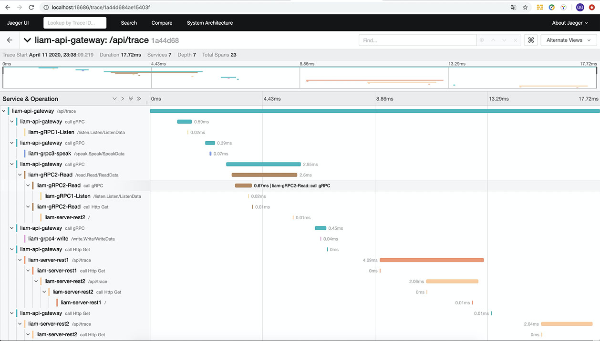
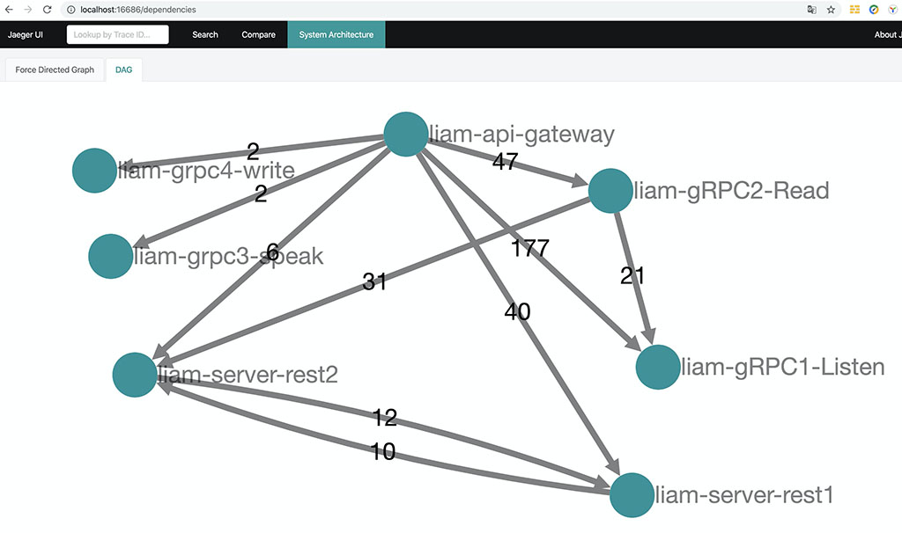

# 链路跟踪

> 基于[Jaeger](https://www.jaegertracing.io/docs/1.17/)的链路跟踪

## Demo

### Jaeger本地环境

```shell
cd deploy/docker/jaeger
docker-compose up -d
```

### 启动Rest、GRPC 服务器

```shell
# 入口 :7410
go run example/gateway/main.go

# http 链路 : 7421
go run example/rest1/main.go

# http 链路 : 7422
go run example/rest2/main.go

# grpc 链路: 9901
go run example/grpc1/main.go

# grpc 链路: 9902
go run example/grpc2/main.go

# grpc 链路: 9903
go run example/grpc3/main.go

# grpc 链路: 9904
go run example/grpc4/main.go
```

### 测试链路跟踪

```shell
curl http://localhost:7410/api/trace
```

访问：http://localhost:16686/ 查看jaeger服务数据信息，选择"api-gateway" -> "Find Traces"

## 效果图

jaeger:

详情


## 安装

```shell
go get github.com/go-liam/tracing
```

## 使用(默认单实例)

### Gin服务器

详情查看 [example/gindemo/main.go](example/gindemo/main.go)

### GRPC

详情查看 [example/grpcdemo/main.go](example/grpcdemo/main.go)

## 多实例应用

详情查看 [tracing.go](tracing.go) ,在自己项目 Sv2 := new(jaeger.SvJeager) 然后全局使用它就行了。

## 配置设置

```go
import (
    "github.com/go-liam/tracing"
)
	tracing.Init(&config.TraceConfig{IsOpen: false, HostPort: "127.0.0.1:6831", SamplerType: "const", SamplerParam: 0.01, LogSpans: true})
```

[采样设置参考](https://www.jaegertracing.io/docs/1.17/sampling/)

## 单元测试

```shell script
go test $(go list ./... | grep -v /example/) -coverprofile=coverage.data ./...

go test -coverpkg=./... -coverprofile=coverage.data ./...
```

## 异常处理

设置 trace属性  IsOpen = false,关掉服务。
